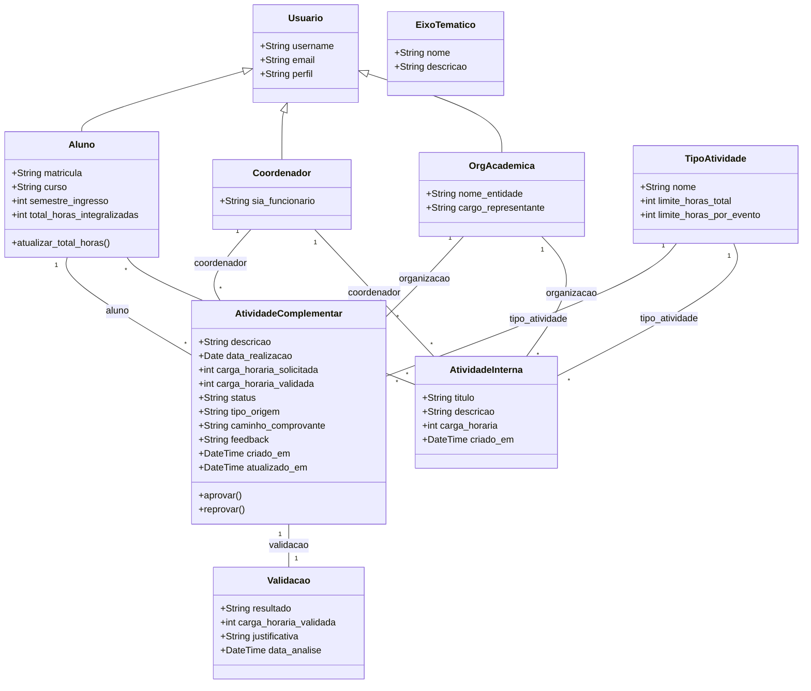

#  Diagrama de Classes - Projeto AAC_Refeito

## Visão Geral

O sistema AAC_Refeito foi modelado com os seguintes principais objetos:

- `Usuario` (customizado, herdado de `AbstractUser`)
- `Aluno`
- `Coordenador`
- `OrgAcademica`
- `EixoTematico`
- `TipoAtividade`
- `AtividadeComplementar`
- `AtividadeInterna`
- `Validacao`

## Diagrama de Classes Simplificado

## Descrição das Classes

- `Usuario`: usuário personalizado com o campo `perfil` (ALUNO, COORDENADOR, ORG).
- `Aluno`: armazena matrícula, curso, semestre e total de horas integralizadas.
- `Coordenador`: representa o usuário que analisa atividades externas.
- `OrgAcademica`: representa a organização responsável por cadastrar atividades internas.
- `EixoTematico`: define uma categoria geral para tipos de atividade.
- `TipoAtividade`: define limites de horas e pertence a um eixo temático.
- `AtividadeComplementar`: representa atividades externas solicitadas por alunos e validadas por coordenadores.
- `AtividadeInterna`: representa atividades lançadas por coordenadores ou organizações e com participantes.
- `Validacao`: registra resultado, carga validada e justificativa das análises de atividades complementares.

## Observações

- O método `Aluno.atualizar_total_horas()` calcula o total de horas aprovadas com base nas atividades complementares com status `APROVADO`.
- O método `AtividadeComplementar.aprovar()` ajusta a carga validada conforme o limite do tipo de atividade e atualiza o histórico de validação.
- `AtividadeInterna` tem uma relação de muitos-para-muitos com `Aluno` para registrar participantes.

