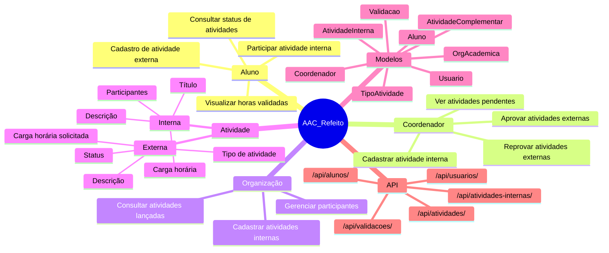

## Introdução

O mapa mental descreve as funcionalidades e os perfis do sistema AAC_Refeito, um backend Django para gestão de Atividades Acadêmicas Complementares.

## Mapa Mental - Projeto AAC_Refeito

## Conclusão

O sistema AAC_Refeito organiza as atividades complementares em três perfis e disponibiliza os principais fluxos necessários para cadastro, validação e acompanhamento de horas de forma integrada.

## Referências

> Faculdade IBMEC. Documentação de Atividades Acadêmicas Complementares. 2026.

## Versionamento

| Data | Versão | Descrição | Autor(es) |
| -- | -- | -- | -- |
| 13/06/2026 | 1.1 | Atualização para o projeto AAC_Refeito | Miguel, Maria Luisa e Bento |